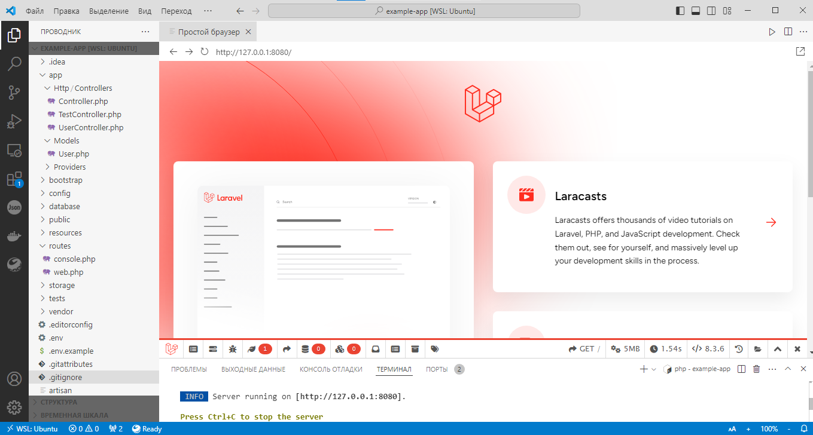

# Laravel. Homework 1. Тогочакова Евгения

Установить PHP, Composer, Laravel, запустить встроенный веб-сервер Laravel. 
Сделать скриншот веб-страницы с информацией о фреймворке Laravel.

``
php artisan serve --port=8080
``

